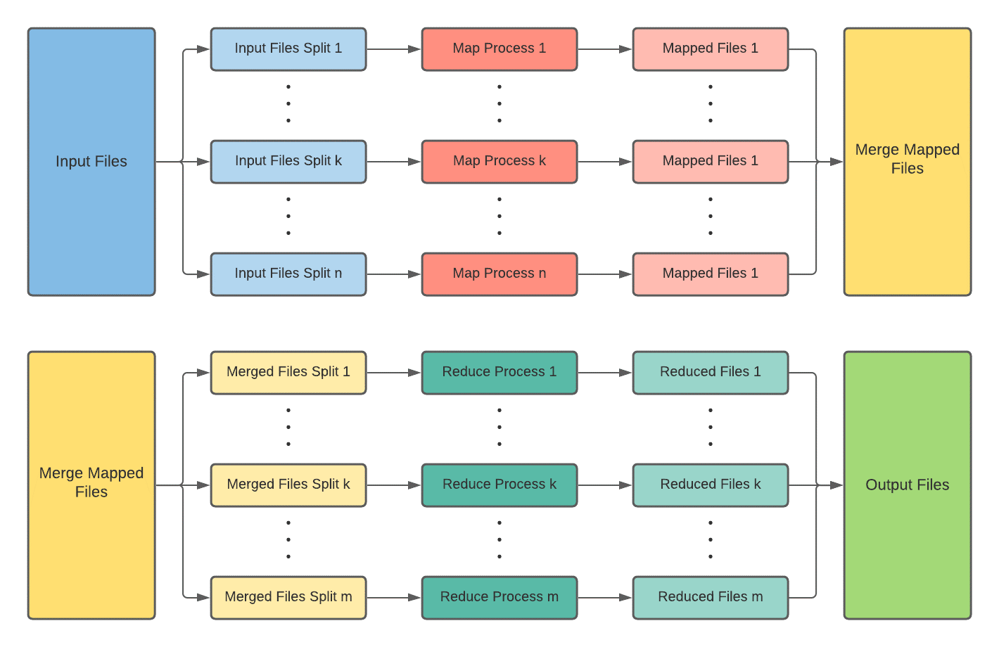
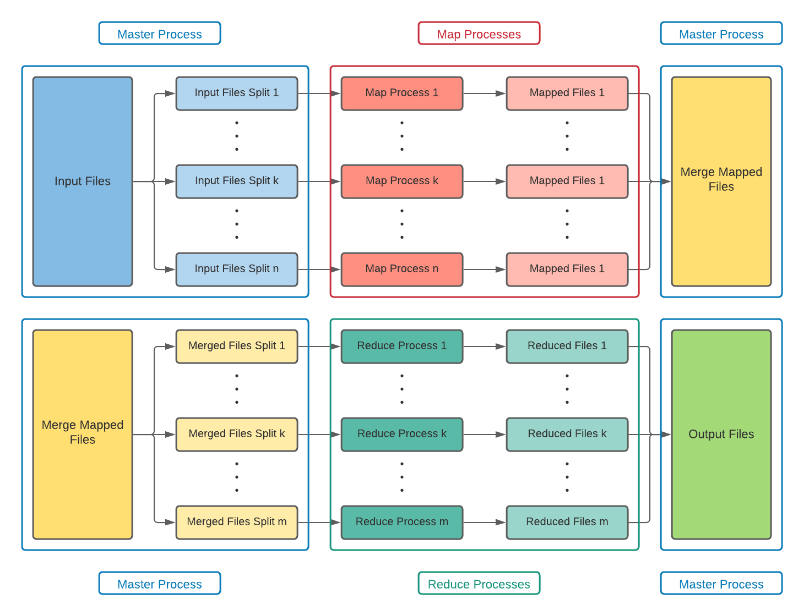

# Map Reduce

## Description
Application that determines the number of occurrences of a word in every given file using MapReduce. 
MapReduce is a programming paradigm used for processing, big sets of data. This process usually happens parallel, each process processes a chuck of files.
Is composed of 2 steps (or 3 if is a merge phase), mapping and reducing. Map phase creates primitive tuples `<key, value>` from the input files and reduce phase "combines" these tuples in the same form.

The workflow looks like this:

    

## Requirements
- Python 3.7+
- Pyhon MPI (pip install mpi4py)
- IDE (optional - PyCharm/VsCode) 

## Implementation
Are 3 types of processes, master, map and reduce. 

    

- Master process will distribute the files to each process (map and reduce) and will merge the files from the map phase. Before merging it waits for all map processes to finish. The merge consists of merging the result from "word.txt" (processed by process 1) and the same file "word.txt" processed by another map process into a single file.
- Map process will read line by line each given file, trim the line (for Windows to remove certain characters because each word will have a file). Therefore the line is split into words and each word will have a file "word.txt" with tuples `<filename: 1>` (one occurrence in that file). Every process will have its own folder to avoid file concurrency.
- Reduce process will take each file "word.txt" and will combine (sum)  the tuples `<filename: 1>` into tuples `<filename: occurrences>`.

## References
- [Talend - MapReduce](https://www.talend.com/resources/what-is-mapreduce/)